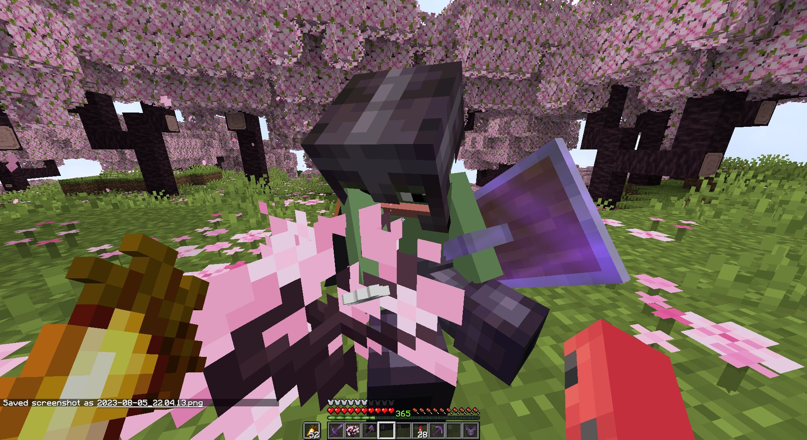
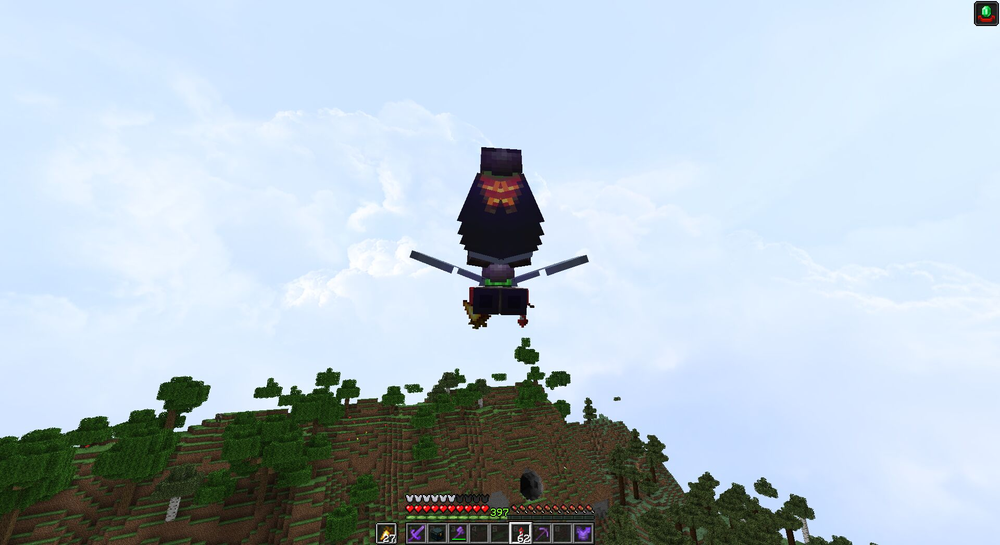
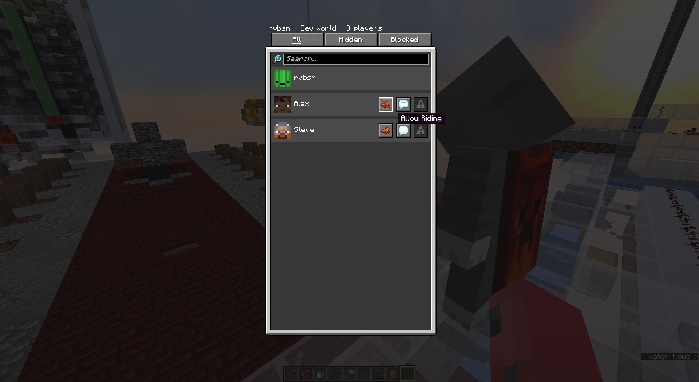
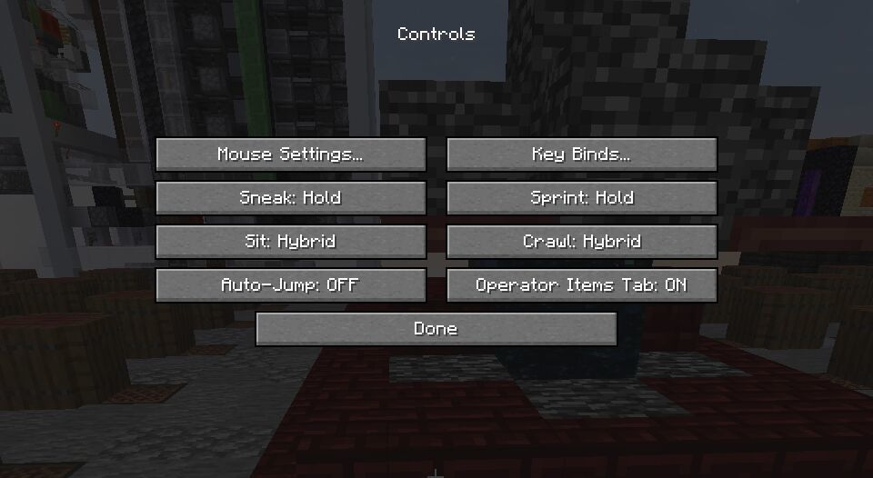
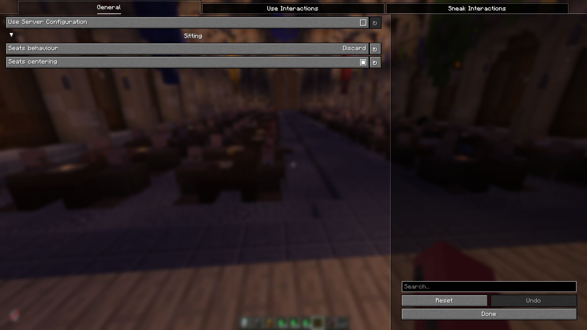

# FSit

Customizable server-side mod that allows players to sit, crawl, and ride each other.
Client-side is supported too,
it allows players to improve their experience by syncing configuration
and adding some client-side mod behaviour improvements.

> [!NOTE]
> Inspired by [GSit] Spigot plugin.

## Usage

Having this mod installed on the server is enough, players are not forced to have it to be able to use it.

However, installation on the client will bring some QoL improvements for players using this mod.
Such as configuration syncing, better crawling, key bindings, and riding restrictions.

### Interacting with blocks

Interact with the topside of the block, that can be sat on, to start sitting on them.



Controlled with [`on_use.sitting`](#on_usesitting) and [`on_use.range`](#on_userange).

### Interacting with players

Interact with any player to start riding them.



Controlled with [`on_use.riding`](#on_useriding) and [`on_use.range`](#on_userange).

#### Riding restrictions (client)

Players can restrict other players from riding them.



Can be accessed with [Social Interactions Screen] or using `/fsit:client allow|restrict <player>`.

### Sneaking

Double sneak while looking down to sit right away. ([`on_sneak.sitting`](#on_sneaksitting))

Doing the same, but near the hole will start crawling otherwise. ([`on_sneak.crawling`](#on_sneakcrawling))

Minimal pitch and maximum sneak window can be configured with [`on_sneak.min_pitch`](#on_sneakmin_pitch) and [`on_sneak.delay`](#on_sneakdelay) accordingly.

### Commands

`/sit` and `/crawl` commands for corresponding actions are available.

### Key bindings (client)

Use key bindings to start sitting (default: RCtrl) or crawling (default: RAlt).

Key bindings have three modes: **Hold**, **Toggle**, and **Hybrid**.
**Hold** and **Toggle** works the same as Vanilla.
**Hybrid** is an in-between mechanic, that works as Toggle on single-use and as Hold on holding.



## Configuration

As was stated before, players can use their own configurations if they have this mod installed on the client.
Otherwise, server configuration will be used.

Configuration can be viewed or edited on the server with `/fsit <option> [value]`.
Reloading from the file can be done with `/fsit reload`.

For clients, configuration can be modified with [Mod Menu] and [YetAnotherConfigLib] installed.



<details>
<summary><i>What is that in the background?</i></summary>

WaveTech's villager trading matrix by [cubicmetre](https://youtu.be/oJDRiV3kJJI)
designed by [mrmaxmondays](https://youtu.be/8OLzXqe3f5g). 

</details>

### Default configuration file

```yaml
use_server: false
sitting:
  behaviour: gravity
  should_center: false
on_use:
  sitting: false
  riding: false
  range: 2
  check_suffocation: true
  blocks:
    - "#slabs"
    - "#stairs"
    - "#logs"
on_sneak:
  sitting: true
  crawling: true
  min_pitch: 60.0
  delay: 600
```

<details>
<summary>Options details</summary>

### `use_server`

When set to `true`, forces all players (server) or player (client) to use server's configuration.

Players' configuration will still be received and processed by the server, but will be ignored when accessed.

Re-disabling this option does not require resynchronizing players' configuration.

### `sitting.behaviour`

Controls sitting behaviour. Possible values: `nothing`, `discard`, `gravity`.

* `nothing` – does nothing, ignores everything;
* `discard` – seats will be discarded if they do not have any supporting block underneath;
* `gravity` – seats can be pushed by fluids, pistons, etc. Will start falling without a supporting block;

### `sitting.should_center`

Place seats in the centre of the block.

### `on_use.sitting`

Allows sitting by interacting with blocks.

### `on_use.riding`

Allows riding by interacting with players.

### `on_use.range`

Interaction radius for sitting and riding features.

### `on_use.check_suffocattion`

Restricts player from completing interaction if it results in their suffocation.

### `on_use.blocks`

List of blocks and block tags that are available to interact with.

### `on_sneak.sitting`

Allows player to start sitting by double sneaking.

### `on_sneak.crawling`

Starts crawling instead of sitting if there is a hole nearby.

### `on_sneak.min_pitch`

Minimal required player's pitch to start registering sneak actions. Where -90 is straight up, and 90 is straight down.

### `on_sneak.delay`

The window between sneaks to be recognized as double sneak action. Measured in milliseconds.

</details>

## Contributing

Pull requests are welcome.  
For major changes, please open an issue first to discuss what you would like to change.

### Translations

New or updated translations are more than appreciated,
they can be found at [src/main/resources/assets/fsit/lang](./src/main/resources/assets/fsit/lang).

Fields with keys `*.description.1` are indefinite and can have any number of lines,
you are free to create new or remove keys with `description.<n>` when needed.

### Building

Since the project uses [Stonecutter], the build is performed using `chiseledBuild` task:

```shell
> ./gradlew chiseledBuild
```

Publishing is done with `chiseledPublish` task, 
must be used only after successful `chiseledBuild` task.

```shell
> ./gradlew chiseledPublish
```

For further versioning info, visit the [Stonecutter Wiki].

## License

This project is licensed under the [MIT License](./LICENSE).

[gsit]: https://github.com/Gecolay/GSit

[social interactions screen]: https://minecraft.wiki/w/Social_interactions

[mod menu]: [https://modrinth.com/mod/modmenu]
[yetanotherconfiglib]: [https://modrinth.com/mod/yacl]

[stonecutter]: https://github.com/stonecutter-versioning/stonecutter
[stonecutter wiki]: https://stonecutter.kikugie.dev
